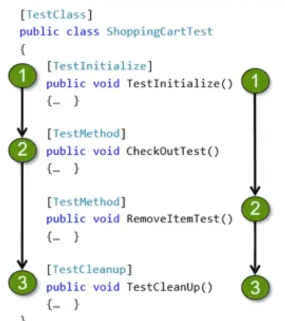

# Unit Test
## Test Level
```csharp

    [TestClass]
    public class CartTest
    {
        [TestInitialize]
        public void TestInitialize()
        {
            //Arrange
        }

        [TestCleanup]
        public void TestCleanup()
        {
          //ClearMeth
        }

        [TestMethod]
        public void AddToCart()
        {
            //Act
            //Assert
        }
```



- [Documentation 1](https://docs.microsoft.com/en-us/visualstudio/test/unit-test-basics?view=vs-2019)
- [Documentation 2](https://docs.microsoft.com/en-us/previous-versions/visualstudio/visual-studio-2010/ms245572(v=vs.100))
